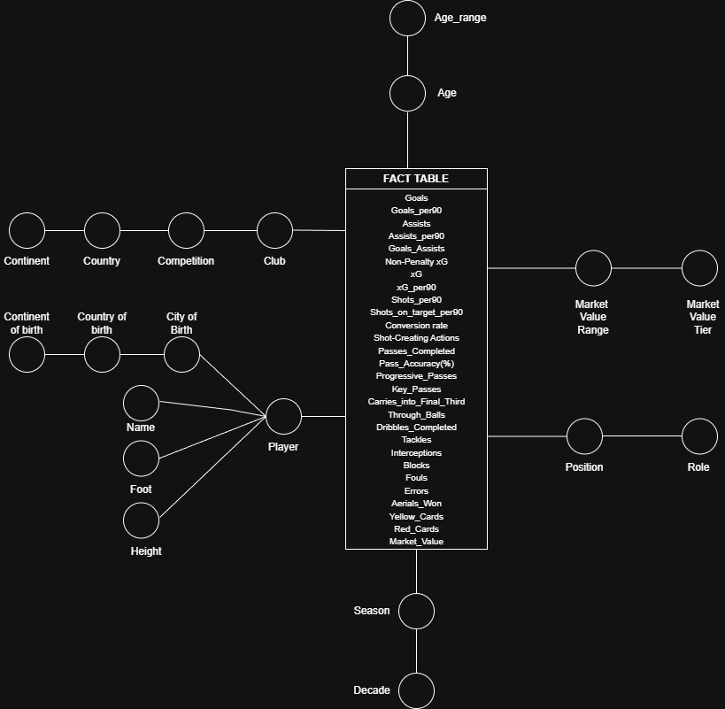

# Football Player Analytics Data Warehouse

A university Data Warehousing project that integrates football performance statistics and historical player market valuations into a multidimensional analytical model. The repository covers the reconciled data layer, dimensional modeling, PostgreSQL-oriented exports, and OLAP-style analysis in Tableau.

## Project overview

The project studies professional players in the top five European leagues—Premier League, Serie A, La Liga, Bundesliga, and Ligue 1—over the 2018–2024 period. It combines season-level sporting performance with player, club, competition, demographic, transfer, game, and market-value data.

The objective is not to copy the source CSVs directly into a database. The Python ETL workflow cleans and harmonizes the sources, resolves inconsistent entities, enriches incomplete records, selects reliable player-season observations, and maps the result to a Star Schema suitable for OLAP analysis.

## Motivation and problem statement

The source data is distributed across many CSV files. Performance measures are separated by topic, while valuations and reference entities use different identifiers and naming conventions. Common issues include:

- inconsistent player, club, and competition names;
- a player's current club differing from the club represented in a historical season;
- missing country, continent, birth-year, and age values;
- multiple valuation dates for the same player and season;
- performance and valuation histories covering different time ranges;
- data that is convenient for collection but not for multidimensional analysis.

A Data Warehouse provides a consistent analytical grain and shared dimensions for comparing performance and market value across seasons, clubs, leagues, roles, age groups, countries, and continents.

## Data sources

| Source | Repository location | Main content |
| --- | --- | --- |
| [Football Data Warehouse](https://www.kaggle.com/datasets/conalhenderson/football-data-warehouse/data) | `data/dataset_1/` | Standard, shooting, passing, passing types, possession, defensive, goal/shot-creating action, miscellaneous, playing-time, and goalkeeper statistics. Each statistics row represents a player-season observation. |
| [Player Scores](https://www.kaggle.com/datasets/davidcariboo/player-scores/data) | `data/dataset_2/` | Player valuations plus `players.csv`, `clubs.csv`, `competitions.csv`, `games.csv`, and `transfers.csv` reference data. |

The repository currently includes CSV snapshots from both sources, together with cleaned and selected derivatives. Their original Kaggle terms and licenses still apply.

## Repository structure

```text
.
├── ETL.py                         # Earlier staged ETL/prototyping script
├── ETL_new.py                     # Consolidated ETL and PostgreSQL-load draft
├── DFM.png                        # Dimensional Fact Model
├── Star Schema.png                # Logical warehouse schema
├── presentation.ppt               # Academic project presentation
├── olap.twb                       # Tableau workbook using the warehouse CSVs
├── Analysis/
│   ├── 1/                         # Actual goals versus expected goals analysis
│   ├── 2/                         # Market value by position and role
│   ├── 3/                         # Talent scouting by continent and country
│   └── 4/                         # Age, role, and competition analysis
└── data/
    ├── dataset_1/                 # Performance source files and cleaned variants
    ├── dataset_2/                 # Valuation and entity-reference source files
    ├── global_selected_8000/      # Quality-selected, aligned player-season files
    ├── final_selected_8000/       # Integrated analysis files and enrichments
    └── postgre/                   # Fact/dimension CSVs and Tableau query output
```

Important generated artifacts include:

- `data/global_selected_8000/`: eight performance files, valuations, and selected player metadata for 8,000 player-season pairs;
- `data/final_selected_8000/merged_stats_all.csv`: the wide analytical merge of the selected statistics and valuation fields;
- `data/final_selected_8000/game_played.csv` and `valuations_with_transfers.csv`: game-result and transfer enrichments retained outside the current Star Schema;
- `data/postgre/`: six dimension CSVs, `fact_player_statistics.csv`, and `query.csv`, which contains RPI score/rank fields used by the analyses.

## ETL pipeline

The ETL is implemented in Python with pandas. `ETL_new.py` is the most consolidated expression of the intended end-to-end workflow; `ETL.py` preserves earlier staged experiments and transformations.

1. **Extract source data.** Load the performance CSVs and the valuation, player, club, and competition reference files.
2. **Enrich valuations.** Resolve player, current-club, and domestic-competition identifiers through the reference tables, construct full player names, convert valuation dates to years, and retain observations from 2018 onward.
3. **Repair demographic attributes.** Use `players.csv` to fill nationality, birth country, and birth year where possible. Infer missing age as `season - birth year`, build a country-to-continent lookup from known rows, and remove records still missing critical birth information.
4. **Normalize competitions.** Map the source competition slugs to Premier League, Serie A, La Liga, Bundesliga, and Ligue 1; competitions outside this scope are discarded.
5. **Reconcile club names.** Apply explicit mappings for known mismatches, remove common club-name terms, and use `rapidfuzz.process.extractOne` with a score threshold above 85 for remaining candidates.
6. **Create the seasonal club attribute.** Build a `(player, season) -> squad` lookup from the performance files. This produces `club_in_year`, with the valuation record's current club used only as a fallback.
7. **Derive analytical attributes.** Add season decade plus market-value range and tier fields.
8. **Select consistent player-season records.** Keep pairs that occur in the valuation history, require country and continent, sum missing-cell counts across the performance files, and select the 8,000 pairs with the lowest total missingness. Duplicate player-season rows are reduced to the first retained row in each exported file.
9. **Prepare the warehouse.** Merge selected data, create the six dimensions and fact-table CSV, map dimension identifiers into the fact, and export the load-ready files to `data/postgre/`.
10. **Load PostgreSQL.** The final section of `ETL_new.py` uses SQLAlchemy and the `psycopg2` PostgreSQL dialect to append the CSVs to the warehouse tables.

## Data Warehouse design

The conceptual Dimensional Fact Model places football performance and market-value measures at the center of the analysis. Its descriptive branches become dimensions in the logical Star Schema.




### Star Schema tables

The implemented schema contains one fact and six dimensions. Transfer and game data exists in the repository but is not modeled as a dimension in this version.

| Table | Role and main attributes |
| --- | --- |
| `Fact_PlayerStats` | Central player observation with foreign-key fields for player, age, position, club, season, and market. Measures include goals, assists, goals plus assists, xG and non-penalty xG, per-90 rates, shots, shot-creating actions, completed and progressive passes, progressive carries, key passes, final-third carries, through balls, tackles, interceptions, blocks, clearances, fouls, errors, aerials won, cards, and market value. |
| `Dim_Player` | Player name, height, preferred foot, city/country of birth, and continent of birth. |
| `Dim_Age` | Exact age and an age-range hierarchy (`≤21`, `22–25`, `26–29`, `30–33`, `34+`). |
| `Dim_Position` | Detailed position combinations and the broader role grouping: goalkeeper, defender, midfielder, or forward. |
| `Dim_Club` | Seasonal club, competition, country, and continent. |
| `Dim_Season` | Season and decade. The checked-in warehouse snapshot covers 2018 through 2024. |
| `Dim_Market` | Market-value range and market-value tier for grouping players economically. |

The checked-in `data/postgre/fact_player_statistics.csv` contains 8,643 fact rows. This is a repository snapshot rather than a benchmark or production dataset.

## Example analytical questions and OLAP analysis

The warehouse can support questions such as:

- How do actual goals and xG evolve by league, season, and decade?
- Which positions or roles have the highest market values and performance rates?
- How strongly is market value associated with attacking, passing, or defensive output?
- Which clubs and competitions contain the most productive or valuable players?
- Do younger players overperform or underperform relative to their market tier?
- How do player performance and valuation differ by country or continent of birth?
- Does the relationship between age and performance differ by role and league?

## Results and Tableau analysis

The project presentation and `Analysis/` screenshots document four Tableau sessions:

| Analysis | OLAP focus | Evidence |
| --- | --- | --- |
| Actual versus expected performance | Goals and xG by competition and decade, with drill-down to season | [`Analysis/1`](Analysis/1/) |
| Market valuation and role | Median market value by detailed position, rolled up to broad role | [`Analysis/2`](Analysis/2/) |
| Global talent scouting | RPI score and market value by continent, drilled down to country with continent slices | [`Analysis/3`](Analysis/3/) |
| Peak age by role | Age-range, competition, and role comparisons using drill-down, dice, and pivot operations | [`Analysis/4`](Analysis/4/) |

`olap.twb` reconstructs the Star Schema in Tableau's logical layer from the files in `data/postgre/`. This CSV-based approach was used because the project presentation identifies Tableau Public's direct database-connection limitation. The repository contains a workbook and analysis screenshots rather than a packaged `.twbx` workbook or published dashboard URL.

## Technologies used

- Python 3 and pandas for ETL and data preparation
- NumPy for supporting transformations
- RapidFuzz for fuzzy club-name matching
- PostgreSQL as the relational warehouse target
- SQLAlchemy with the `psycopg2` dialect for database loading
- SQL and pgAdmin for warehouse work and analysis preparation
- Tableau for the OLAP interface and visual analysis

## Reproducing the project

### 1. Create a Python environment

```bash
git clone https://github.com/mattia9203/Data-Warehouse-on-football-data.git
cd Data-Warehouse-on-football-data
python3 -m venv .venv
source .venv/bin/activate
```

There is no `requirements.txt` or `pyproject.toml` in the repository. Based on the imports in `ETL_new.py`, the provisional dependencies are:

```bash
pip install pandas numpy rapidfuzz SQLAlchemy psycopg2-binary
```

A pinned dependency file should be added before treating the workflow as reproducible.

### 2. Prepare the input layout

The required data is already checked in. If rebuilding it from Kaggle, preserve the file names and place the sources under:

```text
data/dataset_1/
data/dataset_2/
```

At minimum, the consolidated ETL expects `players.csv`, `clubs.csv`, `competitions.csv`, `player_valuations.csv`, and the topic-specific performance CSVs listed in the repository.

### 3. Review the ETL configuration

Before execution, resolve the items in [Notes / TODO](#notes--todo), configure the local PostgreSQL connection without committing credentials, and back up the source files. The consolidated script rewrites CSVs in `data/dataset_1/` during cleaning and appends database rows during its load phase.

After those configuration issues are addressed, the intended entry point is:

```bash
python ETL_new.py
```

The selected and warehouse-ready outputs are written to `data/global_selected_8000/` and `data/postgre/`.

## Database setup

`ETL_new.py` targets a local PostgreSQL database named `Football_DW` and uploads these tables with `DataFrame.to_sql(..., if_exists="append")`:

```text
Dim_Player
Dim_Market
Dim_Club
Dim_Season
Dim_Position
Dim_Age
Fact_PlayerStats
```

The database itself can be created with the standard PostgreSQL client:

```bash
createdb Football_DW
```

No SQL DDL/schema file is present in the repository, so there is currently no accurate `psql -f <schema.sql>` command to run. If pandas creates missing tables during `to_sql`, the result will not reproduce the primary keys, foreign keys, and constraints shown in `Star Schema.png`. A version-controlled schema script should therefore be created before relying on automated database reconstruction. Do not store database passwords in the repository.

## Limitations

- Player and club reconciliation is partly heuristic; fuzzy matches require manual validation.
- Matching by full player name can confuse namesakes, spelling variants, and abbreviated names.
- Market value changes over time and may not align exactly with the performance period represented by a season.
- Selecting the 8,000 lowest-missingness pairs improves consistency but introduces a data-quality selection bias.
- The current Star Schema does not expose the available transfer or game-result enrichments as dimensions or fact tables.
- The RPI score is present in `data/postgre/query.csv` and the presentation, but its SQL definition is not versioned in the repository.
- Market-tier labels differ between the consolidated ETL logic and the checked-in `dim_market.csv` snapshot and should be reconciled.
- This is an academic analytical project, not a production-ready data platform.

## Future work

- Replace name-only joins with stronger player and club entity-resolution rules.
- Add more leagues and seasons while recording source coverage explicitly.
- Formalize market-value bands and validate them consistently across ETL and BI layers.
- Decide whether games and transfers should become dedicated dimensions, facts, or derived measures.
- Add a PostgreSQL DDL script, materialized views, and automated dimension-first loading.
- Add ETL tests for row counts, uniqueness, referential integrity, accepted ranges, and fuzzy-match review.
- Pin Python dependencies and move configuration to environment variables.
- Version the RPI query/formula and add a packaged or published Tableau dashboard.

## Academic context and author

This repository was developed by **Mattia Maucione** for the Data Management course at Sapienza University of Rome, academic year 2024–2025. It demonstrates data integration, a reconciled layer, dimensional modeling, relational loading, and OLAP analysis in an academic setting.

## References

- [Football Data Warehouse dataset](https://www.kaggle.com/datasets/conalhenderson/football-data-warehouse/data)
- [Player Scores dataset](https://www.kaggle.com/datasets/davidcariboo/player-scores/data)
- [Python documentation](https://docs.python.org/3/)
- [pandas documentation](https://pandas.pydata.org/docs/)
- [RapidFuzz documentation](https://rapidfuzz.github.io/RapidFuzz/)
- [PostgreSQL documentation](https://www.postgresql.org/docs/)
- [SQLAlchemy documentation](https://docs.sqlalchemy.org/)
- [Tableau Public](https://public.tableau.com/)

## Notes / TODO

- Correct the `D1_DIR` and `D2_DIR` configuration in `ETL_new.py` so it matches the repository's `data/dataset_1/` and `data/dataset_2/` paths.
- Define the selection constant used by the consolidated script (`TOP_N = 8000`) and resolve remaining variable-name mismatches such as `dim_pos` versus `dim_position`.
- Ensure output directories are created and validate the selected-valuation merge before the fact and dimensions are regenerated.
- Add a pinned dependency file and a PostgreSQL DDL file with explicit data types, keys, and constraints.

### Assumptions made

- `ETL_new.py` is treated as the intended consolidated entry point because it contains extraction, transformation, warehouse generation, and loading; `ETL.py` is treated as an earlier staged reference because its workflow is currently enclosed in multiline strings.
- A “season” is documented using the integer year stored in the CSVs (2018–2024), even though football seasons commonly span two calendar years.
- Schema descriptions are derived from `DFM.png`, `Star Schema.png`, the `data/postgre/` headers, and the project presentation because no SQL DDL is available.
- The RPI analysis is described only at the level supported by the presentation, screenshots, and `query.csv`; no undocumented formula is assumed.
